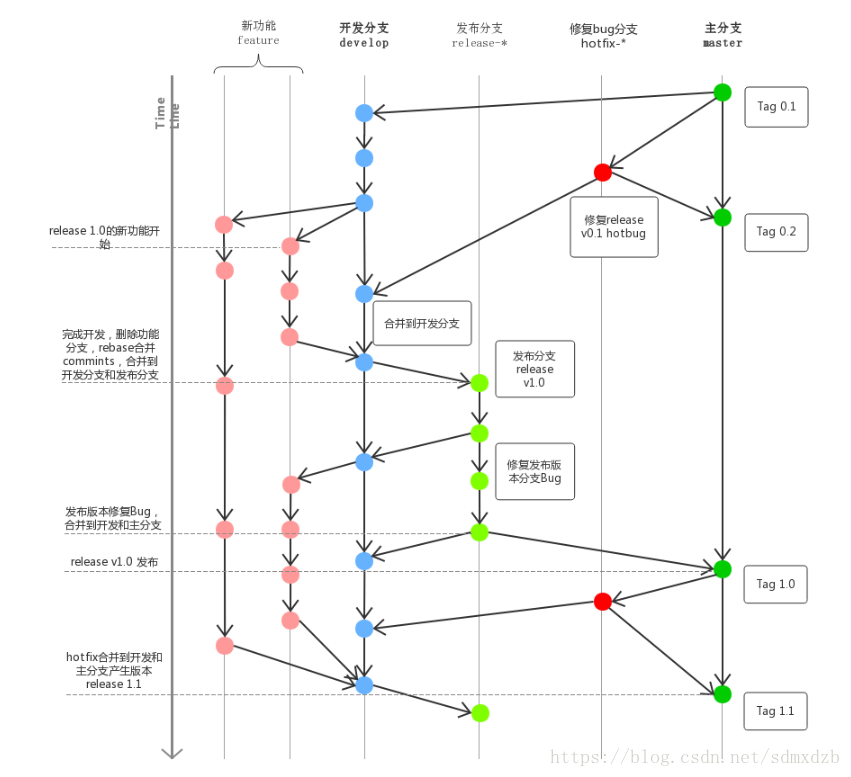
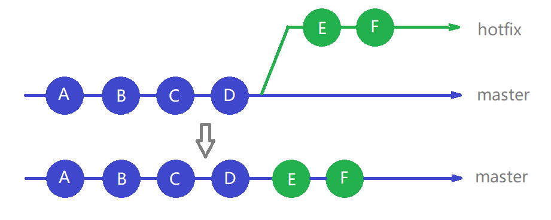
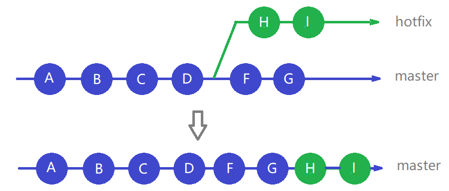

> 记录工作中使用 git 的一些实践经验


<!-- more -->


## Git Flow 略图解



## Commit 规范

我们使用 `Angular` 的规范。借助 `gitcommitizen` 书写规范的 commit message 。借助 `commitlint` 强制校验 commit message 是否符合 `Angular` 规范

## 开发流程

### 新功能开发

当开发新功能时，如果不是非常简单的功能，必须新键功能分支。从 `master` 分支拉取，分支命名规则为 feat/版本/功能名字_创建时间，例如：`feat/2.0.0/teacher-attendace_190918`

版本使用规范的三位版本号。时间使用 `YYMMDD` 的格式


### 提测

功能开发完成后，先自测。自测 OK 后，在当前的 feature 分支打包，提交到测试。

如果与其他同事共同开发同一个应用不同功能，且双方都开发完成了。为了方便测试工作，需要先合 这些开发完的 `feature` 分支为一个分支，再打包提交测试。

`feature` 分支合并后的命名规则为 feat/版本/功能1名字+功能2名字_合并时间，例如 `feat/2.0.1/addjust-class+teacher-attendance_190922`

提测阶段 测试提交的 `bug` 在对应的 `feature` 分支上修复。待所有 `bug` 修复完成后方可提交 `MR` （没有 MR 阶段则合并到 dev 分支）


### 发布

发布前，确保 `feature` 都已开发完成，并合并到了 `dev` 分支，上一个版本的 `hotfix` 分支也合并到了 `dev` 分支。从 `dev` 分支拉取 `release` 预发布分支，命名规则为：releas/版本_时间。例如 `release/2.0.1_191016`。打包后提交测试，测试的 `bug` 在当前预发布分支修复。

如果 `bug` 存在上一个版本中，需要在对应的 `hotfix` （下文会提及）分支修复并合并到当前预发布分支。如果版本发布前要开发下一个版本的功能，需要在 `dev` 上来取对应的分支进行开发。

待所有 `bug` 修复完成后，到了约定的发布时间，在预发布分支打包，准备发版。

成功发布后，`release` 分支合并到 `dev` 分支，合并到 `master` 分支。合并到 `master` 后，修改版本号，提交 `commit` 并打上版本的 `tag`，并从 `master` 分支拉取 `bug` 修复分支，命名规则为：hotfix/版本号，例如：`hotfix/2.0.0`


### 线上修复

线上反馈的 `bug` ，在对应版本的 `hotfix` 分支上修复。修复完后提测，再更新到正式环境。待下一次发布时，一起合并到 dev 分支。

`hotfix` 分支提供长期维护

## Git 操作

### 分支合并

分支合并一般使用 2 种合并方式：`merge` `rebase`。

rebase 可以整理分支提交信息，生成简介清晰的提交记录，但操作比较复杂。如果你不熟悉 rebase ，merge 是最快捷，最安全的方式。但 merge 产生的提交记录会产生许多分叉，对代码回溯，阅读提交记录产生巨大的困扰。

使用 merge 的场景：

1. 开发并自测完成后 feature 分支并入 dev
2. 发布完成后 release 分支并入 dev ，release 分支并入 master

使用 rebase 的场景：

1. hotfix 分支并入 dev
2.

> 所有 merge 的操作都可以使用 rebase 实现。

### 保存工作区

临时保存工作区，使用 `git stash`，不区分分支

查看保存的工作区 `git stash list`

恢复最后一次保存的工作区，`git stash pop` 。恢复后会删除保存记录，可以使用 `git stash apply stash@{index}` 代替


### 版本重置

git reset

### 查看提交记录

git log

git show


## 设置 "remote tracking" 属性

git pull 和 git push 操作的前提是本地分支与对应的远程分支建立的联系

建立联系的方法有：

1.基于远程分支检出一个新的分支

`git checkout -b localMaster origin/master`

2.将本地已存在的分支(localMaster)关联到远程分支(master)上。

`git branch -u o/master localMaster`

如果当前在 localMaster 上，可省略该参数。`git branch -u o/master`


## git rebase 分支变基

`git rebase <branch> [target-branch]` 参照 branch 分支对 target-branch (默认是当前分支) 分支进行变基操作

操作效果如下：

参照 master 在 debug 上创建 master 提交的副本(hash 不变)，并把 debug 分支的工作追加到 master 提交副本上，形成 master 的提交成为 debug 父提交。

如果分叉后 master 有过提交，则 debug 的提交的 hash 会改变


## git rabse -i 交互模式变基


### branch、 HEAD 参数解释

`git rebase -i <branch | HEAD> [target-branch]`  是对 [target-branch] (默认当前分支) 的 commit 进行操作。

- <HEAD> 参数，就是对指定的 HEAD 之后的的（不包括 HEAD）的提交进行 rebase 操作

- <branch> （分支名）参数，就是指定某个分支作为参照(基准)，寻找与之最近的一次公有的 commit （不包括该 commit）之后的提交，进行 rebase 操作


### 修改历史提交

git commit --amend 可以修改最后一次提交，但对于历史提交，要如何修改？

比如你要修改 HEAD^^ 的提交

执行 `rebase -i HEAD~3` 进入 rebase 交互模式

把你要修改的 HEAD^^ 的 `pick` 改成 `edit` 或者 `e` ， wq 保存退出

用 git log 你发现那个 HEAD^^ 在第一个了。

这时你可以使用 git commit --amend 修改这个 commit。修改完后 git rebase --continue 就可以了。

进入 rebase 交互模式后，调整提交的顺序并保存修改，就可以修改提交顺序

> 提示
被修改的 commit 节点之后的 commit 节点的 hash 都会变化！
中途可以 git rebase --abrot 取消操作


### 合并提交多个历史提交

比如合并最后 3 提交为一次提交

执行 `git rebase -i HEAD~3`

出现历史 commit 的列表，最下面的提交记录才最新的！

git 可以把后面新的提交压缩到之前的提交，只要把列表前的 `pick` 改成 `s` 或 `squash`。

上面的命令显示 3 条 commit ，我们把第二、三条 commit 的 `pick` 改成 `s` 。

输入 wq 指令保存后，会弹出编辑 message 的界面，可以为此次合并输入新的 message。默认使用第一、二、三条的 message 记录。

> 提醒
只能把设为 `squash` 的 commit 合并到它前一个 commit，所以第一个 commit 不能设为 `squash`
如果设置的 `squash` 不连续，会产生多个合并，并多次提示输入新的 message
*对本地版本库历史提交的修改导致与远程仓库版本不一致，需要强制 push ！合作开发的时候尤其需要注意，避免代码覆盖的情况！*


### 合并分支

假设：现在有两个分支 master （稳定版）、hotfix (修补)

要求：在 hotfix 分支修复 bugs 后（已经累计多次 commit 记录），合并到 master 并发布新的稳定版

合并分支操作（merge）分两种情况：fast-forward (快进)、recursive (递归)。其中快进模式不会产生额外的 commmit，递归模式需要为本次合并创建一个 commit

下图分别是符合这两种情况的分支情况图示



<center>fast-forward (快进)</center>

*****


<center>recursive (递归)</center>

不管是快进模式还是递归模式，合并后 master 分支都会保留 hotfix 的历史提交记录。甚至还会多一个合并节点（递归模式）。
但是大多数情况下，我们希望 master 分支到提交记录是清晰、干净的。每次合并只出现一个合并节点。如下图


如何实现？依次执行如下指令

```bash
# 切换到 master 分支
git checkout master
# 压缩 hotfix 分支的 commit，并合并到工作区
git merge hotfix --squash
# 查看工作区的状态，你可以看到工作区的变化
git status
# 手动执行 commit 操作，完成最终合并
git commit -am 'merge hotfix into master: fixed xx xx x'
# 合并后可删除 hotfix 分支
git branch -d hotfix
```

这时 master 分支合并 hotfix 分支只有一个 commit （在建立 hotfix 分支后，master 又有提交记录，master 分支会保留这些提交记录，并处在合并节点之后）

> 由于在 hotfix 分支上的提交记录的用户，和管理 master 分支的用户不是一个用户。而这种合并操作最后一步需要手动 commit 并填写 message，这样就丢失了 hotfix 上的原始提交记录的 author time message 信息

所以第二种比较合理的合并方式是：先对 hotfix 进行变基，再并入 master

如何实现？依次执行如下指令

```bash
# 切换到 hotfix 分支
git checkout hotfix
# 对照 master 分支进行变基，压缩所有历史提交到一个提交
git rebase -i master
# 变基完成后，查看当前 hotfix 分支相对 master 分支，你会发现 hotfix 分支只前进了一个 commit
git log --oneline
# 切换到 master 分支
git checkout master
# fast-forward 模式合并 hotfix 分支即可
git merge hotfix
# 合并后可删除 hotfix 分支
git branch -d hotfix
```

## 如何显示当前分支名称

```bash
git symbolic-ref --short -q HEAD
git rev-parse --abbrev-ref HEAD
git branch | grep "*"
```

## 漂亮的 log

```bash
git log --graph --pretty=format:'%C(auto)%h %C(green)%ad %C(cyan)%cn %C(auto)%d %s %C(green)(%cr)' --date=short
```
把上述命令配置成 alias `git config [--global] alias.logs 'log --graph ...... --date=short'`

<center> --- *The End* --- </center>
